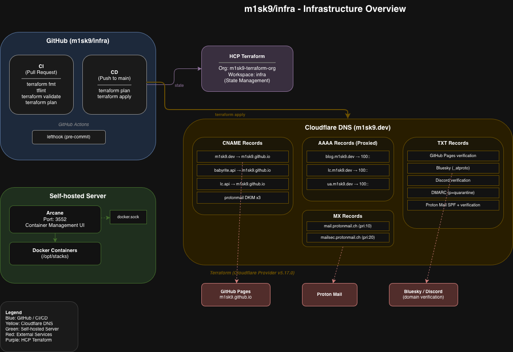

# infra

Managed infrastructure for my open source projects.

## Background

This server configuration must meet the following requirements:

- Minimal time and effort required for maintenance.
- Use of Tailscale or Cloudflare Zero Trust to ensure that servers are not exposed to the public internet.
- Independence from the home network.
- Applications running on the server should be containerized with Docker as much as possible.

## Architecture

> A detailed infrastructure diagram is available at [`docs/infra-overview.drawio`](./docs/infra-overview.drawio).

- Applications run in Docker containers, and dynamic data is managed on the host file system.
- Users can only access the system if they are specifically invited, and only via Tailscale. Devices not connected to the Tailnet cannot access the servers.
- If Tailscale Funnel is unavailable, Cloudflare Zero Trust is used for authentication. In this case, only users with administrator-level, enhanced email addresses can connect; all others are denied access.

## Terraform

Terraform configuration files are located under the [`/terraform`](./terraform) directory to manage Cloudflare DNS records for `m1sk9.dev` as Infrastructure as Code (IaC). State is managed by [HCP Terraform](https://app.terraform.io/) (organization: `m1sk9-terraform-org`, workspace: `infra`).

These configurations are applied automatically via GitHub Actions:

- **CI** (on pull request): Runs `terraform fmt`, `tflint`, `terraform validate`, and `terraform plan`.
- **CD** (on push to main): Runs `terraform plan` and `terraform apply`.

### Configuration Files

- [`cloudflare_dns_record.tf`](./terraform/cloudflare_dns_record.tf): Manages DNS records
- [`main.tf`](./terraform/main.tf): Main Terraform configuration file
- [`provider.tf`](./terraform/provider.tf): Configures the Cloudflare provider
- [`variables.tf`](./terraform/variables.tf): Defines variables used in the Terraform configuration

## Dockge

[Dockge](https://github.com/louislam/dockge) is used to manage Docker containers on the self-hosted server. The Dockge configuration is located under the [`/dockge`](./dockge) directory.

- Runs on port `5001`
- Manages Docker Compose stacks in `/opt/stacks`
