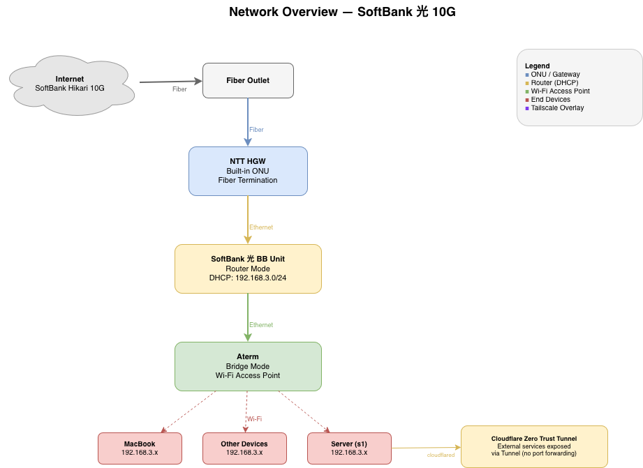

# Network

> [!NOTE]
> This network topology is subject to change. See [TODO](#todo) for planned improvements.

## Overview

The home network runs on a **SoftBank 光 10G** fiber connection. All servers and services are protected by [Tailscale](https://tailscale.com/) — devices not connected to the Tailnet cannot access any internal resources.



A detailed network diagram is available at [`docs/network-overview.drawio`](../docs/network-overview.drawio).

## Topology

```
Fiber Outlet
  └─ (Fiber) ─ NTT HGW (Built-in ONU)
       └─ (Ethernet) ─ SoftBank 光 BB Unit (Router Mode, DHCP: 192.168.3.0/24)
            └─ (Ethernet) ─ Aterm (Bridge Mode, Wi-Fi Access Point)
                 └─ (Wi-Fi) ─ Devices (e.g. MacBook, 192.168.3.x)
```

| Device | Role | Mode | Notes |
|---|---|---|---|
| NTT HGW | ONU + Gateway | — | Built-in ONU, fiber termination |
| SoftBank 光 BB Unit | Router | Router Mode | DHCP server, subnet `192.168.3.0/24` |
| Aterm | Wi-Fi AP | Bridge Mode | Provides wireless connectivity |

## Security

- All network access is gated through **Tailscale**. Devices outside the Tailnet have no route to internal services.
- External service exposure uses **Cloudflare Zero Trust Tunnels** (see [`../terraform/cloudflare_tunnel.tf`](../terraform/cloudflare_tunnel.tf)), never direct port forwarding.

## TODO

- [ ] Restructure the network topology (current setup is minimal and subject to change)
